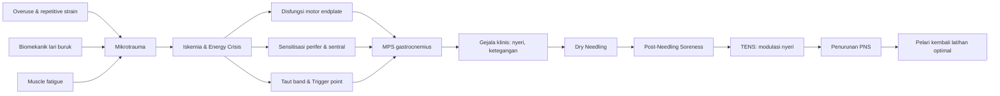

```mermaid
flowchart LR
  FR1[Overuse & repetitive strain] --> MT[Mikrotrauma]
  FR2[Biomekanik lari buruk] --> MT
  FR3[Muscle fatigue] --> MT
  MT --> IC[Iskemia & Energy Crisis]
  IC --> ME[Disfungsi motor endplate]
  IC --> SP[Sensitisasi perifer & sentral]
  IC --> TB[Taut band & Trigger point]
  ME --> MPS[MPS gastrocnemius]
  SP --> MPS
  TB --> MPS
  MPS --> GC[Gejala klinis: nyeri, ketegangan]
  GC --> DN[Dry Needling]
  DN --> PNS[Post-Needling Soreness]
  PNS --> TENS[TENS: modulasi nyeri]
  TENS --> REC[Penurunan PNS]
  REC --> BACK[Pelari kembali latihan optimal]
```
